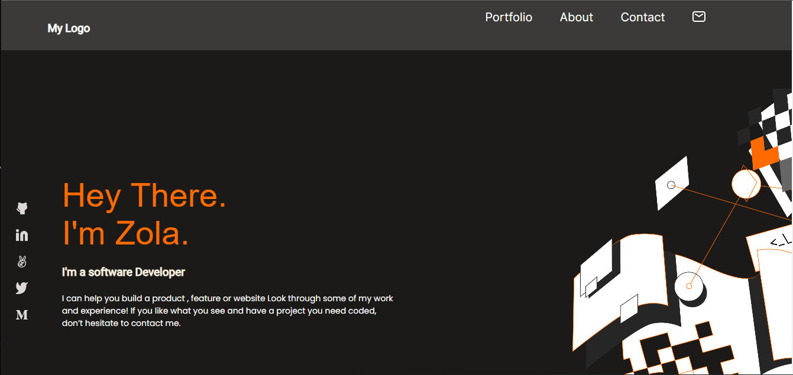

  
  
   

  <h3><b>MY Portfolio</b></h3>

# 📗 Table of Contents

- [📗 Table of Contents](#-table-of-contents)
- [📖 \[Personal--Portfolio\] ](#-personal--portfolio-)
  - [🛠 Built With ](#-built-with-)
    - [Tech Stack ](#tech-stack-)
    - [Key Features ](#key-features-)
  - [🚀 Live Demo](#-live-demo)
  - [💻 Getting Started ](#-getting-started-)
    - [setup](#setup)
    - [Install](#install)
    - [Usage](#usage)
    - [Run tests](#run-tests)
    - [Deployment](#deployment)
  - [👥 Authors ](#-authors-)
  - [🔭 Future Features ](#-future-features-)
  - [🤝 Contributing ](#-contributing-)
  - [⭐️ Show your support ](#️-show-your-support-)
  - [🙏 Acknowledgments ](#-acknowledgments-)
  - [📝 License ](#-license-)

# 📖 [Personal--Portfolio] 

<-This is my personal portfolio site where You can see every detail you want to know about me and list of projects done.

After going through the study material (covering; semantics of HTML5, linters, CSS3, figma, grid, gitflow and flexbox) I applied my knowledge to build a PORTFOLIO repository.

## 🛠 Built With 

### Tech Stack 
1. Linters
2. HTML5
3. cSS3
4. Figma

### Key Features 
[There is a 3-stripped location panel at the right corner]

(<a href="#readme-top">back to top</a>)

## 🚀 Live Demo
Click on this link to access the page live
<a href ="https://zel-hub7.github.io/src">Live Demo Link</a>

## 🚀 Live Demo
Click on this link to access the page
<a href ="https://zel-hub7.github.io/src">Live Demo Link</a>

## 💻 Getting Started 

### setup

Clone this repository to your desired folder

### Install

Install this project with: -Git clone on your cd Desktop using my repository link above

### Usage

-To run the project, copy its path and run it on your online server.

### Run tests

To run tests, run the following command:

npx hint .
npx stylelint "*/.{css,scss}"

### Deployment

You can deploy this project using:

1. Github pages

(<a href="#readme-top">back to top</a>)

## 👥 Authors 

> Mention all of the collaborators of this project.

👤 **Author1**

- GitHub: [@Zelalem](https://github.com/Zel-hub7)
- LinkedIn: [@Zelalem](https://linkedin.com/in/linkedinhandle)

(<a href="#readme-top">back to top</a>)

## 🔭 Future Features <a name="future-features">
1. [Setting up mobile and desktop versions]
2. [Application deploy]
3. [Preserve data in the browser(pair programming)]

</a>

> Describe 1 - 3 features you will add to the project.

- [ ] **[Mobile version of my portfolio]**
- [ ] **[Desktop version of my portfolio]**
- [ ] **[Keep it responsive]**

(<a href="#readme-top">back to top</a>)

## 🤠Contributing 

Contributions, issues, and feature requests are welcome!

Feel free to check the [issues page].

(<a href="#readme-top">back to top</a>)

## ⭐️ Show your support 

If you like this project you can contact me via my contact address and rate it.

(<a href="#readme-top">back to top</a>)

## 🙠Acknowledgments 

I would like to thank all the microverse team and my coding partners.

(<a href="#readme-top">back to top</a>)

## 📠License 

This project is [<a href = "MIT.md">MIT</a>](./LICENSE) licensed.

(<a href="#readme-top">back to top</a>)

